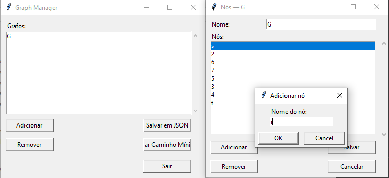
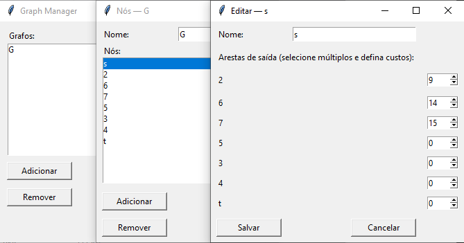
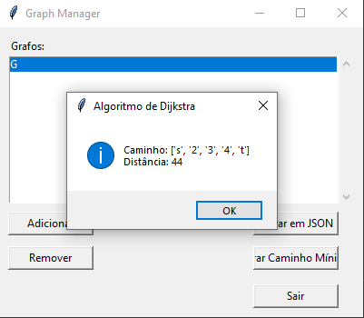

# DijkstraNet

## Sobre 

O DijkstraNet é o resultado do trabalho da Dupla 30 no segundo módulo (Grafos 2) da disciplina de Projeto de Algoritmos, na Universidade de Brasília (UnB/FCTE). Este projeto explora a modelagem de uma rede de computadores como um grafo, onde servidores, roteadores e computadores são os nós, e as conexões entre eles são as arestas. O objetivo principal é encontrar os caminhos de menor latência para a transmissão de dados, utilizando o algoritmo de Dijkstra.

Para isso, construímos uma interface simples para gerenciamento de redes. Basta criar a rede, adicionar os dispositivos (servidores e roteadores), configurar suas conexões e as latências entre elas. A aplicação, então, gera um relatório com os caminhos de menor latência para a comunicação entre quaisquer dois pontos da rede! A seguir, estão listadas algumas das funcionalidades implementadas:

* Criação, remoção, atualização e visualização de redes, servidores e roteadores;
* Navegação totalmente funcional entre menus, facilitando a interação do usuário;
* Serialização dos dados de rede em um banco de dados JSON, garantindo a persistência das informações;
* Cálculo do caminho mais rápido (com menor latência) entre um servidor de origem e um servidor de destino;
* Mensagens de erro e contorno para situações problemáticas, como nós não conectados ou inexistentes.

<br>

## Apresentação

Confira a apresentação do projeto pela [**dupla**](#alunos) no link: ***https://youtu.be/PMUKGMi051E 🔗***

<br>

## Screenshots

Abaixo, estão *screenshots* demonstrando um exemplo do funcionamento do sistema:

### *► Menu Principal*



### *► Edição de Nós*



### *► Caminho Gerado*



<br>

## Requisitos
- **Linguagem**: *Python*
- **Bibliotecas**: *tkinter* (nativa do *Python*)

<br>

## Instalação e Uso

1. Clone o repositório na pasta de sua preferência:

```bash
git clone https://github.com/eduardodpms/UnB_PA
```

2. Navegue até a pasta:

```bash
cd UnB_PA/projects/2_DijkstraNet
```

3. Execute o arquivo *main.py*:

```bash
python main.py
```

<br>

## Alunos

| [](https://github.com/eduardodpms) | [](https://github.com/pedroeverton217) |
|:-:|:-:|
| [*Eduardo de Pina*](https://github.com/eduardodpms) | [*Pedro Everton*](https://github.com/pedroeverton217) |
| 23/1034494 | 22/1008768 |
